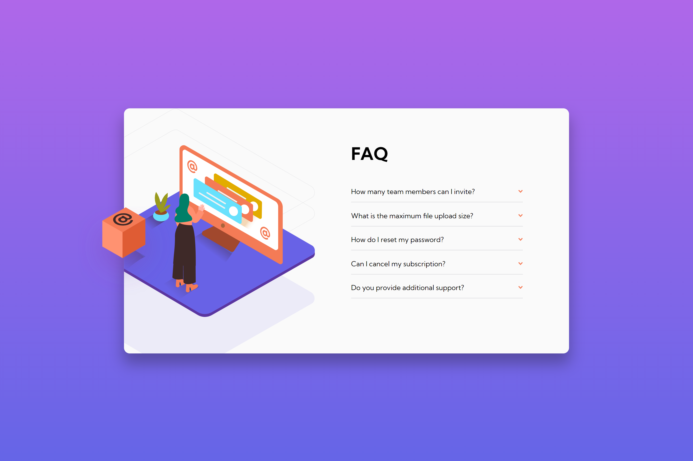

# Frontend Mentor - FAQ accordion card

Esta es una solución al [desafío del FAQ accordion card en Frontend Mentor](https://www.frontendmentor.io/challenges/faq-accordion-card-XlyjD0Oam/hub). Los desafíos de Frontend Mentor lo ayudan a mejorar sus habilidades de codificación mediante la creación de proyectos realistas.

- Solution URL: [Github](https://github.com/ayrtonbolwal/fm-faq-accordion-card)
- Live Site URL: [Netifly](https://ayrtonbolwal-faq-accordion-card.netlify.app/)

## Mi Proceso

- Semántica de HTML5
- Variables en CSS
- Técnicas de Flexbox
- Técnicas de GRID
- Convención BEM
- Técnicas de Position Relative and Absolute
- MediaQuerys
- Javascript Build
- Manejo de estados

## Cosas que aprendí

- Entrega de etapas con Git
- Convención BEM
- Tomar elementos HTML desde JS
- Arrays y Objetos en Javascript
- Control de Backgrounds

## Recursos recomendados

- [Conveción BEM](https://www.freecodecamp.org/espanol/news/convenciones-de-nomenclatura-de-css-que-te-ahorraran-horas-de-depuracion/)
- [Position absolute](https://developer.mozilla.org/en-US/docs/Web/CSS/position)
- [Flex](https://developer.mozilla.org/es/docs/Web/CSS/CSS_flexible_box_layout/Basic_concepts_of_flexbox)
- [Grid](https://developer.mozilla.org/es/docs/Web/CSS/grid)

Happy Coding! 👾🖖
Por fin 150 points!
